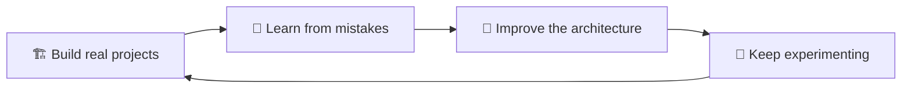

 

 

 

## 👨‍💻 About Me

I'm **Wishwin**, a developer who enjoys turning ideas into practical, polished web and mobile applications.

I like working across the full stack — from crafting clean, intuitive interfaces to designing backend APIs, databases, authentication flows, and application logic. My GitHub is where I experiment, learn new technologies, and grow through real, hands-on projects.

<table>
<tr>
<td width="50%" valign="top">

🔭 &nbsp;Building **full-stack web and Android applications**
 
🌱 &nbsp;Strengthening my knowledge of **backend development, cloud, and CI/CD**
 
🧩 &nbsp;Interested in solving real problems with **simple, useful software**

</td>
<td width="50%" valign="top">

🚀 &nbsp;Currently exploring **GitHub Actions** and modern workflows
 
💬 &nbsp;Always open to **learning, collaborating, and exchanging ideas**
 
📍 &nbsp;Based in **Sri Lanka**

</td>
</tr>
</table>

 

 

## 🚀 Featured Projects

<table>
  <tr>
    <td width="50%">
      <h3 align="center">🧭 Compass LK</h3>
      
A full-stack travel planning platform for exploring Sri Lankan destinations — itineraries, reviews, profiles, and admin tools.

      

        
        
        
        
      

      

    </td>
    <td width="50%">
      <h3 align="center">🎬 CineVault</h3>
      
A full-stack movie & TV media library featuring authentication, search, personal watchlists, and local video streaming.

      

        
        
        
        
      

      

    </td>
  </tr>
  <tr>
    <td width="50%">
      <h3 align="center">✅ DoNext</h3>
      
A modern Android task-management app with authentication, scheduling, local persistence, and Material Design UI.

      

        
        
        
      

      

    </td>
    <td width="50%">
      <h3 align="center">🌱 EcoLearn</h3>
      
An interactive educational web app teaching recycling, waste management, and environmental responsibility.

      

        
        
        
      

      

    </td>
  </tr>
</table>

 

## 🛠️ Tech Stack

**Languages**
 

  

**Frontend**
 

  

**Backend & Databases**
 

  

**Tools, Mobile & Cloud**
 

 

## 🎯 What I'm Focusing On

<table>
<tr>
<td width="50%" valign="top">

**Currently strengthening:**
- 🌐 Full-stack application development
- 🔌 REST API & backend design
- 🗄️ Database design and integration

</td>
<td width="50%" valign="top">

**Also growing in:**
- 📱 Android application development
- ⚙️ Git, GitHub, and CI/CD workflows
- ☁️ Cloud technologies and deployment

</td>
</tr>
</table>

 

## 🤝 Let's Connect

I'm always interested in connecting with other developers, learning from different perspectives, and collaborating on interesting ideas. Feel free to reach out!

  

**Thanks for visiting my profile!** ⭐
*Keep learning. Keep building. Keep improving.*

