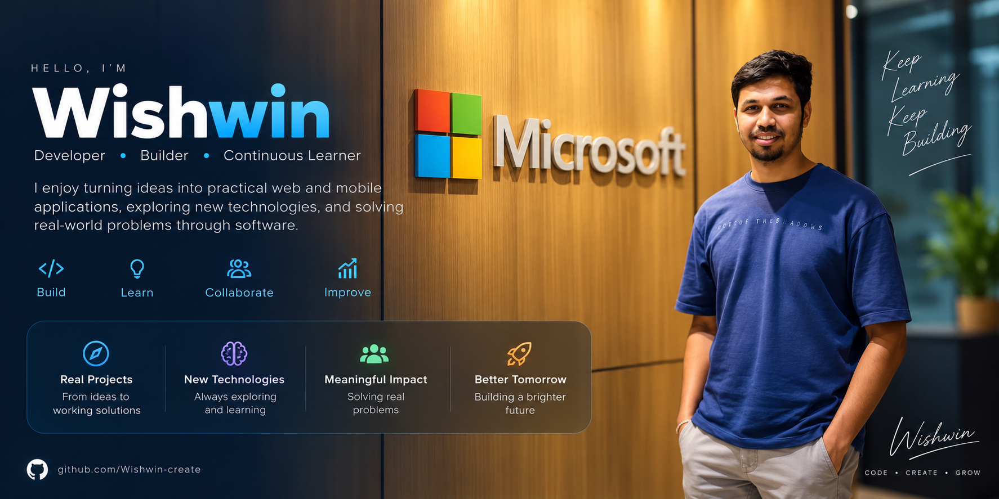

<!-- =====================================================
     HERO
===================================================== -->

  

<!-- =====================================================
     SOCIAL LINKS
===================================================== -->

 

---

## 👨‍💻 About Me

I'm **Wishwin**, a developer who enjoys transforming ideas into practical web and mobile applications.

I enjoy working across the full stack — from designing clean user interfaces to building backend APIs, authentication systems, databases, and application logic.

My GitHub is where I **build, experiment, learn, and continuously improve through real projects**.

<table>
<tr>

<td width="50%" valign="top">

### 💻 What I Do

🔭 Build **full-stack web applications**

📱 Develop **Android applications**

🔌 Work with **REST APIs and backend systems**

🗄️ Design and integrate **databases**

</td>

<td width="50%" valign="top">

### 🌱 What I'm Learning

⚙️ **GitHub Actions & CI/CD**

☁️ **Cloud technologies & deployment**

🏗️ Better **software architecture**

🤝 **Collaboration & development workflows**

</td>

</tr>
</table>

 

---

## 🚀 Featured Projects

<table>

<tr>

<td width="50%" valign="top">

<h3 align="center">🧭 Compass LK</h3>

A full-stack travel planning platform that helps users explore destinations across Sri Lanka, create itineraries, manage profiles, submit reviews, and access administrative features.

</td>

<td width="50%" valign="top">

<h3 align="center">🎬 CineVault</h3>

A full-stack movie and TV media library featuring authentication, search, personal watchlists, profile management, and local video streaming.

</td>

</tr>

<tr>

<td width="50%" valign="top">

<h3 align="center">✅ DoNext</h3>

A modern Android task-management application with authentication, scheduling, local persistence, user profiles, and a Material Design interface.

</td>

<td width="50%" valign="top">

<h3 align="center">🌱 EcoLearn</h3>

An interactive educational web application designed to teach recycling, waste management, and environmental responsibility in an engaging way.

</td>

</tr>

</table>

 

 

---

## 🛠️ Tech Stack

### 💻 Languages

  

### 🎨 Frontend

  

### ⚙️ Backend

  

### 🗄️ Databases

  

### 🔧 Tools, Mobile & Cloud

 

---

## 🎯 What I'm Focusing On

### Build → Learn → Improve → Repeat

*Building practical software while continuously improving my development skills.*

 

<table>

<tr>

<td width="50%" valign="top">

### 🚀 Currently Strengthening

🌐 **Full-Stack Development**  
Building complete applications from frontend to backend.

 

🔌 **REST API & Backend Design**  
Creating cleaner and more maintainable backend systems.

 

🗄️ **Database Development**  
Improving database design, queries, and application integration.

</td>

<td width="50%" valign="top">

### 🌱 Also Growing In

📱 **Android Development**  
Developing practical mobile applications with Java.

 

⚙️ **GitHub & CI/CD**  
Learning GitHub Actions and automated development workflows.

 

☁️ **Cloud & Deployment**  
Exploring cloud platforms and modern deployment practices.

</td>

</tr>

</table>

 

---

## 🤝 Let's Connect

I'm always interested in connecting with other developers, learning from different perspectives, and collaborating on interesting projects.

If you're working on something interesting or just want to talk about software development, feel free to reach out.

 

  

### ⭐ Thanks for visiting!

**Keep learning • Keep building • Keep improving**

